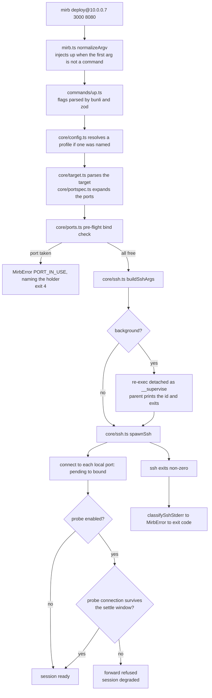
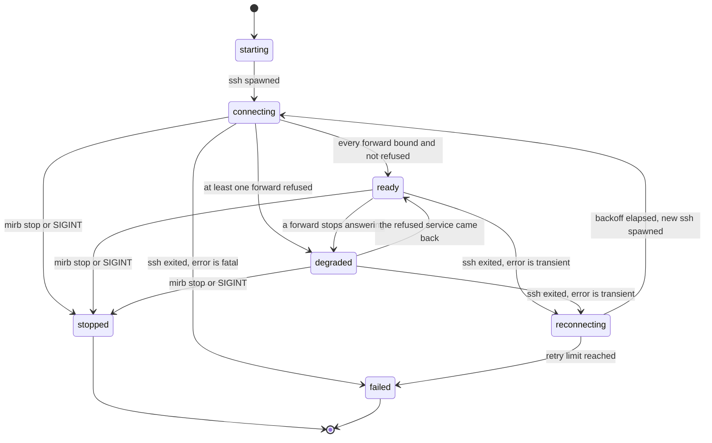
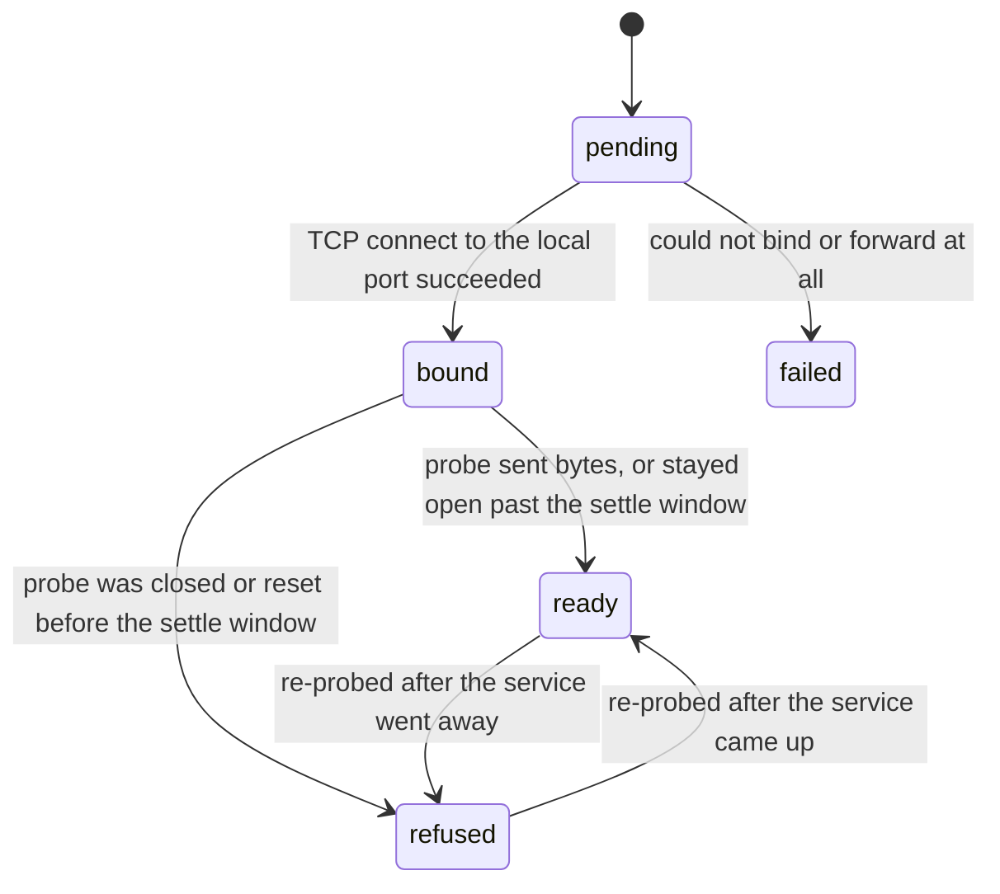

# Architecture

mirrorball is small enough that its architecture is mostly a set of rules about what may depend
on what. This page describes those rules, the path a command takes through them, and the state
that outlives the process.

For the mechanics, see [How it works](./how-it-works.md); for the reasoning behind the boundaries,
[Design decisions](./design-decisions.md).

---

## The three layers

```
mirb.ts         entry point, argv normalization
   |
   v
commands/       wiring: flags -> options -> core calls -> ui calls
   |         \
   v          v
core/        ui/
logic        presentation
```

Dependencies point one way. `commands/` may import from `core/` and `ui/`; neither may import
from `commands/`; and — the rule that matters most — **`core/` never imports from `ui/`**. Code
that decides something must not also decide how it looks.

### `core/` — logic

Everything that determines behaviour: parsing, validation, spawning, state transitions,
persistence, classification. These modules are testable without a terminal, a network, or a
host, because the ones that touch the outside world take their dependencies as parameters rather
than reaching for globals.

| Module | Owns |
| --- | --- |
| `core/types.ts` | The shared contract. Every cross-module type lives here. |
| `core/errors.ts` | `MirbError` (code, message, hint, exit code) and `classifySshStderr`. |
| `core/target.ts` | Parsing, formatting, and argv rendering for a connection target. |
| `core/portspec.ts` | Turning `3000`, `8080:80`, `3000-3005` and friends into `Forward`s. |
| `core/ports.ts` | The pre-flight local bind check, plus `lsof` lookup of a port's holder. |
| `core/bind.ts` | Bind-address normalization and the exposure predicate the `--expose` gate reads. |
| `core/ssh.ts` | `buildSshArgs`, `resolveSshPath`, `spawnSsh`. |
| `core/probe.ts` | `waitForBind` and `probeRemote` — the two connections behind `bound` and `ready`/`refused`. |
| `core/session.ts` | One ssh process and its forwards: the per-forward and per-session state machines. |
| `core/supervisor.ts` | One logical session across many ssh processes: retry policy and the reconnect loop. |
| `core/state.ts` | Session records and log paths: where, atomic writes, zod validation, liveness. |
| `core/config.ts` | `config.toml` loading and profile resolution. |
| `core/ids.ts` | Session id generation, prefix resolution, short display ids. |
| `core/backoff.ts` | `backoffDelay` and `BackoffTracker` for reconnect scheduling. |

Two of these are worth calling out because their shape is a deliberate choice, not an accident.

`core/types.ts` is the keystone: modules depend on the types, never on each other's internals. If
you find yourself importing a concrete module to reach a type, the type belongs in `types.ts`
instead. That is what stops the layer becoming a graph.

`buildSshArgs` is **pure and I/O-free**, separately from `spawnSsh`. argv is the one place where
a one-character mistake silently produces a half-working tunnel, so it is snapshot-tested without
a network, a host, or a binary present. The argument order is fixed and covered by those
snapshots — ssh does not care about order, but a stable one makes `mirb logs` diffable and turns
an accidental reordering into a failing test rather than a mystery in the field.

Environment access follows the same principle. `EnvLike` is passed in rather than read from the
global, so tests never mutate (and race on) the real `process.env`, and the Bunli handler's `env`
threads straight through.

### `ui/` — presentation

Everything that turns state into characters: the live status display, colour, the `mirb ls`
table, spinners, symbols, width-aware truncation. `ui/` reads the types from `core/types.ts` and
renders them, and makes no decision that affects behaviour — so a rendering bug can never break a
tunnel.

Terminal capability is a presentation concern and lives here. `Bun.stringWidth()` handles the
fact that emoji and CJK characters are not one column wide, and `Bun.stripANSI()` handles
measuring text that already carries colour. Whether colour is wanted at all comes from the
`colors` and `terminal` context Bunli hands the command, which already knows what the destination
supports.

### `commands/` — wiring

One file per subcommand, each a `defineCommand({ ... })`. A handler should read as a description
of the operation: validate flags, build a `SessionOptions`, call into `core/`, hand the result to
`ui/` or to `output()`. Business logic in a handler is a smell — it is the one layer that is
awkward to unit-test, because it exists to be glue.

Registered commands: `up`, `ls`, `stop`, `logs`, and the hidden `__supervise`.

---

## From arguments to a running tunnel



Three details in that flow are worth pulling out.

**`normalizeArgv` exists because Bunli has no root command.** `findCommand()` matches argv
against registered command names and throws otherwise, so a bare `mirb 10.0.0.7 3000` would exit
1. mirrorball injects `up` when the first argument is not a reserved command name. Only the first
argument is consulted, deliberately: consulting more risks mistaking an option *value* for a
subcommand, and "position zero decides" is a rule you can hold in your head. `mirb up ls 3000`
therefore targets a host literally named `ls`.

**The bind check happens before ssh is spawned, and is not a guarantee.** Discovering a conflict
from ssh's own stderr would work, but that line arrives *after* authentication — so you would pay
for a full connection, and possibly a 2FA prompt, to learn that port 3000 was busy. Checking
locally is instant and can even name the process. It leaves a TOCTOU window, which
`ExitOnForwardFailure=yes` covers.

**The supervisor and the foreground process run identical code.** Backgrounding changes where
output goes and who owns the process, not what happens: same argv builder, same probe, same
backoff.

---

## The session state machine

`SessionStatus` is an aggregate over the session's forwards, not an independent fact:



`degraded` is the state that justifies the whole design. It means the SSH connection is fine and
at least one forward is not usable — a distinction a tool reporting only "connected /
disconnected" cannot express, and exactly the situation that sends people debugging their
application when the real problem is that nothing is listening on the remote port.

Note that `reconnecting → connecting` spawns a **new** ssh process with identical argv.
mirrorball does not reconnect ssh; it replaces it. Every local port is rebound and every forward
returns to `pending`, which is why a remote service that died and came back moves from `refused`
to `ready` on its own, and why a port something else grabbed in the meantime fails the reconnect
rather than silently coming back short.

Each forward runs its own smaller machine underneath:



`bound` is not a synonym for working. A successful connect proves only that your local ssh is
holding the listener — see
[why a connect cannot establish more than bound](./how-it-works.md#why-a-connect-cannot-establish-more-than-bound).

---

## Where state lives

The root comes from `stateDir('mirb')` in `@bunli/utils`, which follows the XDG base directory
spec on Linux **and macOS** — CLI state goes to `~/.local/state`, not
`~/Library/Application Support`, because that is where someone running a terminal tool expects to
find it. Only Windows diverges. `$MIRB_STATE_DIR` replaces that root wholesale — the seam the
tests use, and what you would set to run two isolated mirrorball instances on one machine.

```
<state root>/
  sessions/
    mb_k3n8dq2xr7p4a.json
  logs/
    mb_k3n8dq2xr7p4a.log
```

| | Linux and macOS | Windows |
| --- | --- | --- |
| State root | `$XDG_STATE_HOME/mirb/`, default `~/.local/state/mirb/` | `%LOCALAPPDATA%\mirb\State\` |
| `config.toml` | `$XDG_CONFIG_HOME/mirb/`, default `~/.config/mirb/` | `%APPDATA%\mirb\` |

Respecting `$XDG_STATE_HOME` is not pedantry: this state is machine-local and disposable, and
must not end up in a dotfile repo or a synced home directory, where a record from another machine
would describe a pid that does not exist here.

### Session records

One `SessionRecord` per session, as JSON. Three properties matter.

**Writes are atomic.** The record is serialised to a sibling temp file and `rename()`d over the
target; `rename(2)` is atomic within a filesystem, so a reader observes the whole old record or
the whole new one, never a half-written file. `mirb ls` racing a supervisor's status update is a
routine event, not an exotic one. There is deliberately no `fsync` — durability across a power
cut is not a goal, since a record that outlives the process it describes is worthless anyway.

**Reads are validated, and so are writes.** The zod schema is checked on the way in *and* on the
way out: a record `listSessions()` would skip should never reach the disk, and catching it at the
write site points at the bug rather than at a mysteriously missing session later. The schema is
non-strict on purpose, so a record written by a newer mirrorball carrying unknown fields still
lists rather than disappearing. A record that is absent reads as `null`; one that exists but is
corrupt throws, because quietly reporting "not found" for a file that plainly exists sends people
looking in the wrong place.

**The `pid` is the supervisor's, not ssh's.** That is the process owning the session lifecycle,
the one `mirb stop` signals, and the one whose liveness decides whether a record is stale —
because a `SIGKILL`ed supervisor never got to write `stopped`, so the `status` field cannot be
trusted on its own. Liveness is checked with signal 0, which performs the existence and
permission checks without delivering anything, and `EPERM` counts as **alive**: a process owned
by another user still exists, and treating it as dead would let mirrorball prune a running
supervisor.

Ids are `mb_` plus a 13-character lowercase alphanumeric nanoid — lowercase alphanumeric because
these get typed, pasted, and grepped, and 13 characters because the collision domain is the
handful of sessions one machine has open at once. Before an id becomes a path it must match
`[a-z0-9_]{1,64}`; ids arrive from argv as well as from `newSessionId()`, and there is no
legitimate `mirb stop ../../..`. You rarely type a whole one: `resolveIdPrefix` matches a leading
fragment git-style, and throws on ambiguity rather than picking one.

### Logs

`logs/<id>.log`, with the absolute path recorded as `logFile` on the record so `mirb logs` never
has to reconstruct a naming convention. The file holds the supervisor's own timestamped reporter
lines (`<ts> mirb: …`) — the same append-only stream `ui/static.ts` produces, which is why a
background session's log reads like the foreground output you would have watched.

ssh's stderr is *not* copied into it verbatim. The supervisor keeps the last 64 KiB of it in
memory — the cap is what stops a chatty `-o LogLevel=DEBUG3` session growing an unbounded
string — and it reaches the log only once it has been through `classifySshStderr`, as the
`error:`/`hint:` pair. That is a deliberate trade: the log stays readable, at the cost of the
raw OpenSSH text being gone after the process exits. If you need the unabridged version, run
the `sshArgv` recorded on the session by hand.

### Config

`config.toml` under `configDir('mirb')` holds named profiles (`MirbConfig` / `Profile`) — a host,
a set of ports, and optional identity, jump host, and bind address — so a daily target becomes
`mirb staging`. It is parsed with `Bun.TOML.parse()` and validated with zod. A malformed config
is a `CONFIG` error, sharing an exit code with `USAGE`, because from the user's side both mean
"mirrorball never tried to connect; fix your input." See [Profiles](../guides/profiles.md).

---

## Machine-readable output

Bunli owns `--format` globally and hands the handler an `output()` that writes an
`{ok, data, meta}` envelope. It sets `agent: true` when stdout is not a TTY, so piping
mirrorball into something yields structured output without anyone passing a flag.

Long-running commands additionally stream `MirbEvent` values as NDJSON — `session.start`,
`forward.bound`, `forward.ready`, `forward.error`, `session.ready`, `session.reconnecting`,
`session.exit` — one JSON object per line, so a consumer can react to a forward becoming ready as
it happens rather than waiting for a process that is designed never to end on its own.

---

## Related

- [How it works](./how-it-works.md) — the ssh command, the readiness model, reconnection.
- [Design decisions](./design-decisions.md) — the trade-offs behind this structure.
- [Testing](../contributing/testing.md) — how the seams above are exercised.
